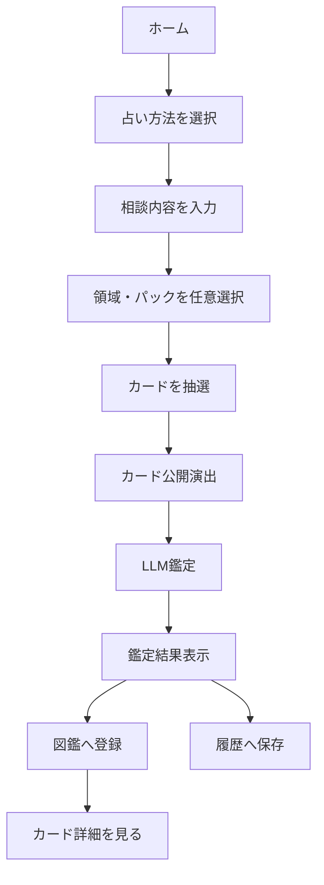
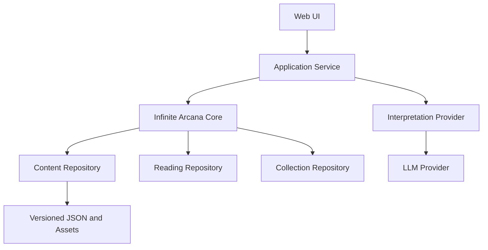
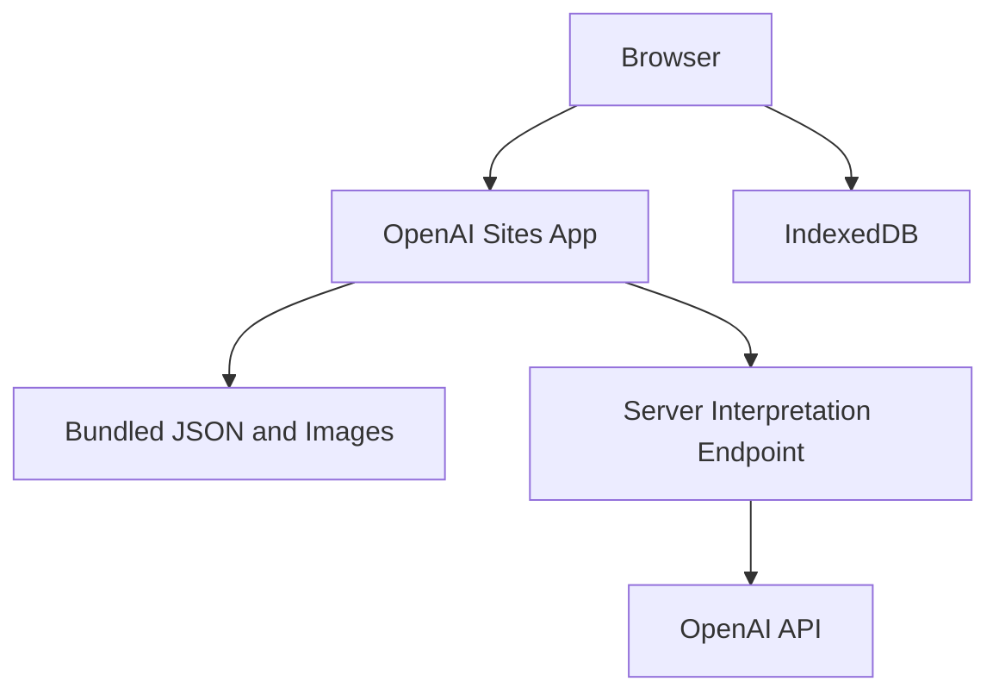
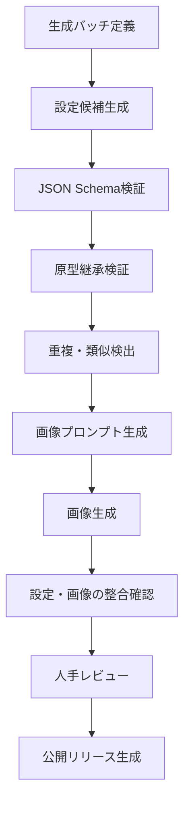

# 無限アルカナ 共通エンジン 要件定義・基本設計書

| 項目 | 内容 |
|---|---|
| 文書バージョン | 0.1.0 |
| ステータス | 初版・実装着手可能 |
| 対象 | 共通エンジン、通常版、OpenAI Sites向け軽量版、コンテンツパイプライン |
| 想定読者 | プロダクトオーナー、アプリ開発者、コンテンツ制作者、レビュー担当者 |

---

## 1. 文書の目的

本書は、架空の大アルカナを用いて占いを行うWebアプリケーション「無限アルカナ」の要件と基本設計を定義する。

無限アルカナでは、既存タロットの大アルカナ22種を「原型」として内部に保持し、それぞれの原型から多数の架空アルカナを派生させる。ユーザーは架空アルカナを抽選し、入力した相談内容とカード設定をLLMが結び付けた鑑定を受ける。引いたカードは図鑑へ登録され、継続的なカード追加、テーマ領域、拡張パックに対応する。

本書では、次の2種類の実行環境を同一の設計で扱う。

1. **Sites軽量版**：DBを使用せず、OpenAI Sitesへデプロイできる検証・公開用Webアプリ
2. **通常版**：ユーザー認証、永続DB、複数端末同期、課金、管理機能などを将来追加できる拡張版

## 2. プロダクト概要

### 2.1 コンセプト

> 22の普遍的な原型が、無数の世界・人物・場所・物品・出来事・概念として顕現する。ユーザーはその中から、現在の自分に対応する架空アルカナと出会う。

例：

- 原型「女教皇」
  - バベルの図書館
  - 閉ざされた索引
  - 月下の記録庫
  - 凍結された神託
- 原型「塔」
  - 空へ落ちる城
  - 逆さまの首都
  - 雷を祀る尖塔

### 2.2 設計原則

1. **原型の中心的意味は必須とする**
   - 架空アルカナは原型の中心的意味を継承する。
   - 表現、物語、象徴、助言、相談分野別の解釈をカード側で拡張する。
   - 原型の中心的意味を否定する完全上書きは認めない。

2. **コンテンツと実行ロジックを分離する**
   - カード、原型、領域、パック、スプレッド、プロンプト設定はJSONで管理する。
   - 抽選、鑑定、図鑑登録などの処理は共通エンジンで扱う。

3. **抽選ポリシーを交換可能にする**
   - 初期実装は原型と架空アルカナの二段階抽選とする。
   - 将来、重み付き、未発見優先、日次固定などのポリシーを追加できる構造とする。

4. **公開済みコンテンツを再現可能にする**
   - 鑑定時点のカードバージョン、抽選条件、鑑定文を保存する。
   - コンテンツ更新後も過去の鑑定表示を変化させない。

5. **LLMの責務を限定する**
   - 抽選やカード設定の決定をLLMへ委ねない。
   - LLMは相談内容、カード設定、配置の意味を結び付け、構造化された鑑定結果を生成する。

6. **レアリティで占い結果を歪めない**
   - レアリティは抽選確率や課金優遇に使用しない。
   - 図鑑上の演出、設定の深さ、画像品質、特別表示などに使用する。

## 3. 用語定義

| 用語 | 定義 |
|---|---|
| 原型（Archetype） | 既存の大アルカナ22種に対応する、変更されにくい意味の骨格 |
| 架空アルカナ（Card / Manifestation） | いずれか1つの原型が、特定の象徴・世界観として顕現したカード |
| 向き（Orientation） | 正位置または逆位置。単純な吉凶ではなく、発現・過剰・不足・抑圧・内面化などを表す |
| 領域（Domain） | 書物、知識、IT、夢、都市、終末などの世界観・意味上の分類 |
| パック（Pack） | カードの公開、配布、販売、期間限定提供を管理する単位 |
| タグ（Tag） | 検索、重複検出、推薦、運営分類に用いる柔軟なラベル |
| スプレッド（Spread） | 1枚引き、過去・現在・未来など、カードの枚数と配置の意味を定義するもの |
| 抽選ポリシー（Draw Policy） | 抽選候補、重み、重複可否、正逆確率などを決定する交換可能な規則 |
| 鑑定（Reading） | 相談内容、抽選結果、LLMによる解釈をまとめた記録 |
| 図鑑（Collection） | ユーザーが過去に引いたカードと発見状況を表示する機能 |
| コンテンツスナップショット | 鑑定時点で使用したカード設定とバージョンを再現するための情報 |

## 4. 対象範囲

### 4.1 MVPに含める機能

- 大アルカナ22原型の読み込み
- 原型ごとに複数の架空アルカナを登録
- 原型→架空アルカナの二段階抽選
- 正位置・逆位置
- 1枚引き
- 3枚引き
- ユーザーによる相談内容入力
- LLMによる構造化鑑定
- 鑑定結果の保存と再表示
- 引いたカードの図鑑登録
- 領域・パック・タグによる分類
- コンテンツの追加・更新
- JSON Schemaによる設定検証
- コンテンツ生成・検品パイプライン
- Sites軽量版へのデプロイ

### 4.2 MVPに含めない機能

- ユーザー自身によるカード生成・公開
- ユーザー間のカード交換
- 占い結果へ影響する課金優遇
- 物理カードの注文・製造連携
- 世界初発見者のサーバー記録
- SNSログイン
- 複数端末同期
- サブスクリプションおよび決済
- 運営用Web管理画面

上記は通常版の将来機能としてデータモデル上の拡張余地を確保する。

## 5. 想定ユーザーフロー



### 5.1 1枚引き

1. ユーザーが相談内容を入力する。
2. 任意で相談カテゴリ、領域、パックを指定する。
3. 共通エンジンが抽選ポリシーに従って1枚を抽選する。
4. 正位置・逆位置を決定する。
5. カードを表示する。
6. LLMが相談内容とカード設定を結び付ける。
7. 要約、カード解釈、助言、内省の問いを表示する。
8. カードを図鑑へ、鑑定全文を履歴へ保存する。

### 5.2 3枚引き

初期スプレッドは「過去・現在・未来」と「状況・障害・助言」を用意する。

1回のスプレッド内では同一カードを重複させない。原型の重複可否はスプレッドまたは抽選ポリシーで設定可能とし、初期値は原型も重複させない。

## 6. 機能要件

### 6.1 コンテンツ管理

| ID | 要件 |
|---|---|
| FR-CNT-001 | システムは22原型をJSONから読み込めること |
| FR-CNT-002 | 各架空アルカナは必ず1つの原型を参照すること |
| FR-CNT-003 | 1枚の架空アルカナは複数領域、複数パック、複数タグを保持できること |
| FR-CNT-004 | カード設定と画像アセット設定を別ファイルで管理できること |
| FR-CNT-005 | 公開状態、コンテンツバージョン、公開期間を管理できること |
| FR-CNT-006 | ビルド前に全JSONをJSON Schemaで検証できること |
| FR-CNT-007 | 参照先IDの存在、ID重複、原型ごとのカード不足を検証できること |
| FR-CNT-008 | 公開済みカードの破壊的変更を検出できること |

### 6.2 抽選

| ID | 要件 |
|---|---|
| FR-DRW-001 | 初期ポリシーは原型→カードの二段階抽選とすること |
| FR-DRW-002 | 原型ごとのカード数が異なっても、原型の基本出現確率を均等に保てること |
| FR-DRW-003 | 抽選対象を公開状態、領域、パック、公開期間で絞り込めること |
| FR-DRW-004 | 正位置・逆位置の確率をポリシーで設定できること |
| FR-DRW-005 | 1回のスプレッド内でカード重複を禁止できること |
| FR-DRW-006 | 原型重複の可否を設定できること |
| FR-DRW-007 | 抽選ポリシーを識別子とバージョンで記録すること |
| FR-DRW-008 | 指定された乱数seedと同一コンテンツ版から同一結果を再現できること |
| FR-DRW-009 | 候補不足時に原因を識別可能なエラーを返すこと |

### 6.3 LLM鑑定

| ID | 要件 |
|---|---|
| FR-LLM-001 | LLMへ相談内容、相談カテゴリ、スプレッド、配置、カード設定を渡すこと |
| FR-LLM-002 | LLMは抽選結果を変更できないこと |
| FR-LLM-003 | LLMは定義済みJSON形式で結果を返すこと |
| FR-LLM-004 | 鑑定は原型の意味と架空アルカナ固有の意味の両方を反映すること |
| FR-LLM-005 | 複数カードの場合、カード間の関係を説明すること |
| FR-LLM-006 | 医療、法律、投資、生死などを断定する鑑定を生成しないこと |
| FR-LLM-007 | 構造化出力の検証失敗時に1回だけ再生成できること |
| FR-LLM-008 | 再生成後も失敗した場合、カード固有の定型解釈を表示できること |
| FR-LLM-009 | プロンプトプロファイルとそのバージョンを記録すること |
| FR-LLM-010 | ユーザー入力を命令ではなく相談データとして境界分離すること |

### 6.4 鑑定履歴

| ID | 要件 |
|---|---|
| FR-HST-001 | 相談内容、抽選結果、鑑定全文、作成日時を保存すること |
| FR-HST-002 | カードID、カード版、原型ID、向き、配置を保存すること |
| FR-HST-003 | 抽選seed、抽選ポリシー版、プロンプトプロファイル版を保存すること |
| FR-HST-004 | 過去の鑑定文はコンテンツ更新後も変更せず再表示すること |
| FR-HST-005 | ユーザーが履歴を削除できること |
| FR-HST-006 | Sites軽量版では履歴をJSONとしてエクスポート・インポートできること |

### 6.5 図鑑

| ID | 要件 |
|---|---|
| FR-COL-001 | 初めて引いたカードを自動的に図鑑へ登録すること |
| FR-COL-002 | カードごとに初回発見日時、最終発見日時、抽選回数を保持すること |
| FR-COL-003 | 未発見カードは名称や画像を伏せて表示できること |
| FR-COL-004 | 原型、領域、パック、タグ、発見状態で絞り込めること |
| FR-COL-005 | レアリティは図鑑表示と演出にのみ使用すること |
| FR-COL-006 | カード詳細で物語、象徴、正逆の意味、原型との関係を表示できること |

### 6.6 領域・パック

| ID | 要件 |
|---|---|
| FR-PCK-001 | 領域とパックを独立したエンティティとして扱うこと |
| FR-PCK-002 | 1枚のカードを複数領域と複数パックへ所属させられること |
| FR-PCK-003 | パックに公開期間、表示順、カバー画像、説明を設定できること |
| FR-PCK-004 | 抽選時に複数領域または複数パックを選択できる構造とすること |
| FR-PCK-005 | 将来の利用権判定を追加できるインターフェースを設けること |

## 7. 非機能要件

| ID | 分類 | 要件 |
|---|---|---|
| NFR-001 | 可搬性 | コンテンツJSONと抽選仕様を特定DB・フレームワークに依存させない |
| NFR-002 | 再現性 | seed、コンテンツ版、ポリシー版が同じ場合、抽選結果を再現できる |
| NFR-003 | 拡張性 | 新しい抽選ポリシー、スプレッド、領域、パックを既存カードの変更なしで追加できる |
| NFR-004 | 性能 | カード抽選と図鑑表示は通常端末で体感待ち時間なく動作する |
| NFR-005 | 障害耐性 | LLMが利用できない場合もカード抽選と定型解釈を表示できる |
| NFR-006 | セキュリティ | LLMプロバイダーのAPIキーをブラウザへ配布しない |
| NFR-007 | プライバシー | 相談内容の保存場所と削除方法を明示する |
| NFR-008 | アクセシビリティ | キーボード操作、十分なコントラスト、代替テキスト、動きの軽減設定へ対応する |
| NFR-009 | 保守性 | 公開用コンテンツと生成履歴・レビュー情報を分離する |
| NFR-010 | 軽量性 | Sites軽量版はDB、認証、外部ストレージなしで主要体験を提供する |
| NFR-011 | 国際化 | 表示文字列をローカライズ可能な構造にし、MVPは日本語のみ提供する |
| NFR-012 | テスト性 | 抽選の既知seed、JSON検証、LLM出力検証に自動テストを用意する |

## 8. 全体アーキテクチャ

### 8.1 論理構成



共通エンジンは、保存先やLLMベンダーを直接参照せず、以下のインターフェースを利用する。

```ts
interface ContentRepository {
  getManifest(): Promise<ContentManifest>;
  getArchetypes(): Promise<Archetype[]>;
  getCards(filter?: CardFilter): Promise<Card[]>;
  getSpread(id: string): Promise<Spread>;
}

interface ReadingRepository {
  save(reading: ReadingRecord): Promise<void>;
  get(id: string): Promise<ReadingRecord | null>;
  list(): Promise<ReadingSummary[]>;
  delete(id: string): Promise<void>;
}

interface CollectionRepository {
  discover(entry: DiscoveryEntry): Promise<void>;
  list(): Promise<CollectionEntry[]>;
}

interface InterpretationProvider {
  interpret(request: InterpretationRequest): Promise<InterpretationResult>;
}

interface RandomSource {
  next(): number;
  seed(): string;
}
```

### 8.2 実装アダプター

| インターフェース | Sites軽量版 | 通常版 |
|---|---|---|
| ContentRepository | ビルド済み静的JSON | CDN／オブジェクトストレージ／API |
| ReadingRepository | IndexedDB、予備としてlocalStorage | PostgreSQL等 |
| CollectionRepository | IndexedDB、予備としてlocalStorage | PostgreSQL等 |
| InterpretationProvider | Sitesのサーバーエンドポイント | APIサーバー |
| RandomSource | seed付き疑似乱数 | 同一仕様のseed付き疑似乱数 |
| 認証 | なし | 認証プロバイダー |
| アセット | デプロイ成果物へ同梱 | CDN／オブジェクトストレージ |

## 9. Sites軽量版設計

### 9.1 目的

Sites軽量版は、DBや認証を用意せずに、無限アルカナの主要体験とコンテンツ品質を検証する公開可能なMVPとする。

### 9.2 構成



- UI、抽選ロジック、図鑑、履歴表示はブラウザで動作する。
- カード設定と画像はデプロイ成果物へ同梱する。
- 相談内容と図鑑は端末内のIndexedDBへ保存する。
- LLM呼び出しだけをサーバー側エンドポイントで実行する。
- APIキーはホスティング環境の秘密値として設定し、クライアントへ返さない。
- LLM障害時はカードに定義された定型解釈を表示する。

### 9.3 Sites軽量版の保存方針

IndexedDBを第一候補とし、実装上の単純化が必要な最初の試作に限ってlocalStorageを使用できる。ただし、リポジトリインターフェースは維持し、後からIndexedDBへ移行できるようにする。

保存対象：

- 鑑定履歴
- 図鑑
- UI設定
- 最終選択したスプレッド・領域
- コンテンツ移行状態

保存しない対象：

- APIキー
- 生成用管理プロンプト
- 非公開カード
- コンテンツレビュー情報

### 9.4 Sites軽量版の制約

| 制約 | 影響 | 対応 |
|---|---|---|
| ブラウザデータ削除で履歴が消える | 図鑑・履歴を失う | JSONエクスポート／インポートを提供 |
| 複数端末で同期できない | 端末ごとに別図鑑 | 通常版で認証・同期を追加 |
| カード追加に再デプロイが必要 | 即時追加不可 | コンテンツ更新をリリース単位で運用 |
| 公開クライアント内の有料カードを完全には秘匿できない | 有料パック保護に不向き | 軽量版は無料公開パックのみ扱う |
| DBなしでは正確な利用回数制限が難しい | API濫用対策が限定的 | 入力長、出力長、同時実行、サーバー側制限を設定 |
| 世界初発見や全体統計を保存できない | 共同収集要素を提供できない | 通常版の機能とする |

したがって、Sites軽量版は「無料MVP・作品展示・体験検証」に適し、決済や厳密な利用権管理は通常版へ委ねる。

### 9.5 推奨画面

1. ホーム／世界観説明
2. 占い設定
3. カード抽選・公開演出
4. 鑑定結果
5. 図鑑一覧
6. カード詳細
7. 鑑定履歴
8. データのエクスポート／インポート
9. 利用上の注意・プライバシー

### 9.6 LLMエンドポイント

概念上のAPI：

```http
POST /api/readings/interpret
Content-Type: application/json
```

入力：

```json
{
  "requestVersion": "1.0.0",
  "locale": "ja-JP",
  "question": "情報を集め続けるべきか、そろそろ決断するべきか",
  "category": "work",
  "spread": {
    "id": "single-card",
    "version": 1
  },
  "draws": [
    {
      "positionId": "guidance",
      "orientation": "upright",
      "archetype": {},
      "card": {}
    }
  ],
  "promptProfile": {
    "id": "default-reflective",
    "version": 1
  }
}
```

サーバーはクライアントから渡されたカード内容を無条件には信用せず、カードIDとコンテンツバージョンを同梱JSONと照合してからLLMへ渡す。

### 9.7 Sites軽量版のAPI濫用対策

- 相談文の最大文字数を設定する。
- 1回の最大カード枚数を設定する。
- LLM出力トークン数を制限する。
- 許可されたスプレッド、カードID、プロンプトプロファイルのみ受け付ける。
- 不正なカード設定をクライアントから注入できないようにする。
- タイムアウトと再試行回数を制限する。
- エラー時に内部プロンプトや秘密値を返さない。
- 永続的な厳密レート制限が必要になった時点で通常版へ移行する。

## 10. 通常版設計

### 10.1 追加可能な構成

- Webフロントエンド
- アプリケーションAPI
- PostgreSQL
- オブジェクトストレージ／CDN
- 認証
- 決済
- 運営管理画面
- ジョブ実行環境

Pythonを使用する場合、通常版APIはFastAPIで実装できる。一方、抽選仕様そのものはTypeScript版とPython版の両方で同じテストベクトルを通し、言語間の結果差を防止する。

### 10.2 将来の主要テーブル

| テーブル | 主な役割 |
|---|---|
| users | ユーザー |
| readings | 鑑定ヘッダー、相談、鑑定全文、各種バージョン |
| reading_draws | 抽選カード、配置、向き、順番、スナップショット |
| collections | ユーザーごとの発見状況 |
| entitlements | パック利用権 |
| content_releases | 公開コンテンツのリリース情報 |
| generation_batches | コンテンツ生成バッチ |
| review_records | 自動検証・人手検品結果 |

コンテンツの正本はバージョン管理されたJSONとし、DBは検索・配信・運営効率化のための投影先として扱うことを推奨する。これにより、Sites軽量版と通常版で同じコンテンツを利用できる。

## 11. JSON構成

### 11.1 推奨ディレクトリ

```text
content/
├── manifest.json
├── archetypes/
│   ├── fool.json
│   ├── magician.json
│   └── ...
├── cards/
│   ├── babel-library.json
│   └── ...
├── domains/
│   ├── books.json
│   └── ...
├── packs/
│   ├── base-infinite.json
│   └── ...
├── spreads/
│   ├── single-card.json
│   └── past-present-future.json
├── prompt-profiles/
│   └── default-reflective.json
├── assets/
│   └── assets.json
├── i18n/
│   └── ja-JP.json
└── schemas/
    ├── manifest.schema.json
    ├── archetype.schema.json
    ├── card.schema.json
    ├── domain.schema.json
    ├── pack.schema.json
    ├── spread.schema.json
    ├── prompt-profile.schema.json
    └── interpretation.schema.json

authoring/
├── generation-batches/
├── source-prompts/
├── review-records/
├── duplicate-reports/
└── visual-provenance/
```

`content/`はクライアントへ配布可能な公開情報、`authoring/`は運営内部情報とする。画像生成プロンプト、モデル名、seed、レビューコメントは原則として`authoring/`へ置く。

### 11.2 共通ルール

- JSON Schema Draft 2020-12を使用する。
- IDは小文字ASCIIのkebab-caseとする。
- IDは公開後に変更しない。
- `schemaVersion`は構造の版、`contentVersion`は個別内容の版とする。
- 日時はISO 8601 UTCとする。
- 列挙値は英語の安定した識別子を使用する。
- 表示文字列はローカライズ可能なオブジェクトとする。
- 未定義フィールドの混入を防ぐため、原則`additionalProperties: false`とする。
- 公開時に全参照整合性とコンテンツハッシュを検証する。

## 12. 主要データモデル

### 12.1 原型

```json
{
  "schemaVersion": "1.0.0",
  "id": "high-priestess",
  "contentVersion": 1,
  "majorArcanaNumber": 2,
  "status": "published",
  "name": {
    "ja-JP": "女教皇"
  },
  "core": {
    "essence": "外部からは直接見えない知識と、内面から得られる理解",
    "requiredThemes": [
      "intuition",
      "hidden-knowledge",
      "receptivity"
    ],
    "forbiddenContradictions": [
      "知識や内省を全面的に否定する"
    ],
    "lightAspects": [
      "直感",
      "洞察",
      "静かな理解"
    ],
    "shadowModes": [
      "情報の秘匿",
      "受動性の過剰",
      "直感と妄想の混同"
    ]
  },
  "inheritancePolicy": {
    "coreEssenceRequired": true,
    "minimumRequiredThemeMatches": 1,
    "cardMayExtend": true,
    "cardMayContradict": false
  }
}
```

### 12.2 架空アルカナ

```json
{
  "schemaVersion": "1.0.0",
  "id": "babel-library",
  "contentVersion": 1,
  "status": "published",
  "name": {
    "ja-JP": "バベルの図書館"
  },
  "subtitle": {
    "ja-JP": "すべての答えが存在する迷宮"
  },
  "archetypeId": "high-priestess",
  "domainIds": [
    "books",
    "knowledge",
    "infinite-architecture"
  ],
  "packIds": [
    "base-infinite"
  ],
  "tags": [
    "library",
    "paradox",
    "search",
    "hidden-truth"
  ],
  "manifestationForm": "place",
  "rarity": "legendary",
  "concept": {
    "centralSymbol": "無限に続く六角形の書庫",
    "centralParadox": "すべての答えが存在するが、目的の一冊を発見できない",
    "lightAspects": [
      "深い探求",
      "直感による発見",
      "知識への敬意"
    ],
    "shadowAspects": [
      "情報への埋没",
      "答えへの執着",
      "探索そのものの目的化"
    ],
    "lore": "世界に存在し得るすべての文章を収めた図書館。"
  },
  "meanings": {
    "upright": {
      "keywords": [
        "直感",
        "探求",
        "隠された知識"
      ],
      "core": "答えは外部に存在するが、それを見つけるには内なる基準が必要である。",
      "advice": "情報を増やす前に、何を探しているのかを定めよ。",
      "warning": "探索すること自体が目的になっていないか確認せよ。"
    },
    "reversed": {
      "mode": "excess",
      "keywords": [
        "情報過多",
        "迷走",
        "誤った確信"
      ],
      "core": "大量の情報によって、自分の判断を見失っている。",
      "advice": "新しい情報を遮断し、すでに得た知識を整理せよ。",
      "warning": "自分に都合のよい答えだけを探している可能性がある。"
    }
  },
  "contexts": {
    "work": {
      "focus": "調査と決断の境界",
      "advice": "判断に必要な情報の終了条件を決める。"
    },
    "relationships": {
      "focus": "相手を理解しようとする姿勢と詮索の境界",
      "advice": "推測ではなく、確認できることを対話する。"
    },
    "creativity": {
      "focus": "参照資料と自分の表現の境界",
      "advice": "調査を止め、小さな試作を始める。"
    },
    "self": {
      "focus": "知識と自己理解の関係",
      "advice": "答えではなく、繰り返し現れる問いを観察する。"
    }
  },
  "visualAssetId": "card-babel-library-v1",
  "accessibility": {
    "altText": {
      "ja-JP": "無限に続く六角形の書架と、その中央に立つ小さな人物"
    }
  },
  "publication": {
    "publishedAt": "2026-01-01T00:00:00Z",
    "retiredAt": null
  }
}
```

### 12.3 逆位置モード

逆位置を単純な悪い意味にしないため、次のいずれかを明示する。

| 値 | 意味 |
|---|---|
| `blocked` | 本来の意味が妨げられている |
| `excess` | 本来の性質が過剰になっている |
| `deficiency` | 本来の性質が不足している |
| `internalized` | 外的出来事より内面で現れている |
| `distorted` | 本来の意味が歪んで現れている |
| `delayed` | 発現が遅れている |

### 12.4 パック

```json
{
  "schemaVersion": "1.0.0",
  "id": "base-infinite",
  "contentVersion": 1,
  "status": "published",
  "name": {
    "ja-JP": "無限領域・基本パック"
  },
  "description": {
    "ja-JP": "異なる世界に顕現した22原型を収録する基本パック。"
  },
  "accessPolicy": "public",
  "coverAssetId": "pack-base-infinite-cover-v1",
  "publication": {
    "publishedAt": "2026-01-01T00:00:00Z",
    "retiredAt": null
  }
}
```

### 12.5 スプレッド

```json
{
  "schemaVersion": "1.0.0",
  "id": "situation-obstacle-advice",
  "contentVersion": 1,
  "name": {
    "ja-JP": "状況・障害・助言"
  },
  "positions": [
    {
      "id": "situation",
      "order": 1,
      "meaning": {
        "ja-JP": "現在の状況を形作っているもの"
      }
    },
    {
      "id": "obstacle",
      "order": 2,
      "meaning": {
        "ja-JP": "見落としている障害や緊張"
      }
    },
    {
      "id": "advice",
      "order": 3,
      "meaning": {
        "ja-JP": "次に取るべき姿勢や行動"
      }
    }
  ],
  "drawPolicyId": "balanced-two-stage-v1",
  "constraints": {
    "uniqueCards": true,
    "uniqueArchetypes": true,
    "allowReversed": true
  }
}
```

## 13. 抽選設計

### 13.1 初期ポリシー

`balanced-two-stage-v1`

1. 公開状態、公開期間、領域、パック、利用権で候補カードを絞り込む。
2. 候補カードを原型ごとにグループ化する。
3. 候補が1枚以上存在する原型から均等に1原型を抽選する。
4. 選ばれた原型内の候補カードから均等に1枚を抽選する。
5. 正位置・逆位置を設定確率で決定する。初期値は各50%。
6. スプレッド制約に従って使用済みカード・原型を候補から除外する。
7. 必要枚数まで繰り返す。

### 13.2 将来追加可能なポリシー

- `weighted-archetype`：原型ごとの重み付き
- `undiscovered-priority`：未発見カードを優先
- `daily-seeded`：ユーザーと日付から日次カードを固定
- `event-window`：期間限定カードを含める
- `domain-affinity`：選択した領域との一致度を反映
- `narrative-sequence`：複数カードの物語的接続を考慮

抽選ポリシーはLLMを使用せず、決定論的なコードとして実装する。

### 13.3 再現性

再現に必要な情報：

- `seed`
- 疑似乱数アルゴリズムIDとバージョン
- コンテンツリリースID
- 抽選ポリシーIDとバージョン
- フィルター条件
- スプレッドIDとバージョン

同一のseedでもコンテンツ集合が変われば結果が変わるため、必ずコンテンツリリースを固定する。

## 14. LLM鑑定設計

### 14.1 LLMへ渡す情報

- ユーザーの相談内容
- 任意の相談カテゴリ
- スプレッドと各配置の意味
- 原型の中心的意味
- 架空アルカナ固有の象徴、矛盾、光、影、助言
- 正位置・逆位置と逆位置モード
- 分野別解釈
- 出力言語
- 鑑定の口調
- 安全上の制約

### 14.2 LLMへ渡さない責務

- カード抽選
- 正逆の決定
- レアリティ判定
- 図鑑登録
- 利用権判定
- 公開状態判定
- カード設定の変更

### 14.3 鑑定出力

```json
{
  "schemaVersion": "1.0.0",
  "summary": "情報を増やす段階から、判断基準を定める段階へ移っています。",
  "cardInterpretations": [
    {
      "positionId": "guidance",
      "cardId": "babel-library",
      "interpretation": "バベルの図書館は、答えの不足ではなく選別基準の不足を示します。",
      "evidence": [
        "隠された知識",
        "探索そのものの目的化"
      ]
    }
  ],
  "relationships": [],
  "advice": [
    "判断に必要な条件を3つに絞る",
    "新しい情報収集の終了時刻を決める"
  ],
  "reflectionQuestion": "あなたが探しているのは新しい情報ですか、それとも決断を先延ばしにする理由ですか？",
  "disclaimerCode": null
}
```

### 14.4 品質方針

- カード設定に存在しない象徴を事実のように創作しない。
- 相談内容を鸚鵡返しせず、カードとの接続を説明する。
- 抽象表現だけで終わらず、実行可能な小さな助言を含める。
- ユーザーの未来、健康、資産、生死を断定しない。
- 恐怖や依存を煽らない。
- 「必ず」「運命として決まっている」などの断定を避ける。
- 占いを意思決定の唯一の根拠にしないよう促す。

## 15. 鑑定記録

```json
{
  "schemaVersion": "1.0.0",
  "id": "reading-uuid",
  "createdAt": "2026-01-01T00:00:00Z",
  "locale": "ja-JP",
  "question": "情報を集め続けるべきか、決断するべきか",
  "category": "work",
  "contentReleaseId": "release-2026-01-01",
  "spread": {
    "id": "single-card",
    "contentVersion": 1
  },
  "drawPolicy": {
    "id": "balanced-two-stage-v1",
    "version": 1,
    "seed": "example-seed",
    "randomAlgorithm": "seeded-prng-v1"
  },
  "filters": {
    "domainIds": [],
    "packIds": [
      "base-infinite"
    ]
  },
  "draws": [
    {
      "positionId": "guidance",
      "archetypeId": "high-priestess",
      "archetypeContentVersion": 1,
      "cardId": "babel-library",
      "cardContentVersion": 1,
      "orientation": "upright",
      "cardSnapshotHash": "sha256:..."
    }
  ],
  "promptProfile": {
    "id": "default-reflective",
    "version": 1
  },
  "modelRecord": {
    "provider": "openai",
    "model": "configured-model",
    "generatedAt": "2026-01-01T00:00:02Z"
  },
  "interpretation": {},
  "fallbackUsed": false
}
```

Sites軽量版では鑑定全文と必要なカード表示スナップショットを端末内に保存する。通常版では同等の情報をDBに保存する。

## 16. コンテンツ生成・検品パイプライン

### 16.1 基本方針

生成パイプラインはアプリの実行環境から分離したオフライン処理とする。Python CLIでの実装を第一候補とし、JSON Schema検証、重複検出、レビュー用レポート生成を自動化する。

### 16.2 ワークフロー



### 16.3 コンテンツ状態

```text
draft
→ generated
→ automatically-validated
→ needs-review
→ approved
→ published
→ deprecated
```

`published`への変更は人手承認を必須とする。

### 16.4 生成バッチ定義

```json
{
  "schemaVersion": "1.0.0",
  "id": "batch-high-priestess-books-001",
  "targetArchetypeId": "high-priestess",
  "targetDomainIds": [
    "books",
    "knowledge"
  ],
  "requestedCount": 10,
  "formDistribution": {
    "person": 2,
    "place": 2,
    "object": 2,
    "event": 1,
    "creature": 1,
    "organization": 1,
    "concept": 1
  },
  "requiredVariationAxes": [
    "era",
    "scale",
    "emotional-tone",
    "central-paradox"
  ],
  "avoidTerms": [
    "永遠の時計",
    "虚無の旅人"
  ],
  "referenceReleaseId": "release-2026-01-01",
  "outputLocale": "ja-JP"
}
```

### 16.5 自動検証

1. JSON Schema検証
2. ID・参照整合性
3. 原型の必須テーマとの一致
4. 原型の禁止矛盾への抵触検出
5. 名前の完全一致・正規化一致
6. キーワード重複率
7. 意味・助言・物語の類似度
8. 同一形態、同一色、同一構図への偏り
9. 正位置と逆位置の差分不足
10. 助言の具体性
11. 禁止表現・高リスク断定
12. 画像アセットの存在と寸法

類似度検出はレビュー支援であり、自動却下の唯一の根拠にはしない。

### 16.6 人手レビュー項目

| 分類 | 確認内容 |
|---|---|
| 原型整合 | 原型の中心的意味を保っているか |
| 独自性 | 既存カードの言い換えに留まっていないか |
| 解釈可能性 | 実際の相談へ接続できるか |
| 正逆品質 | 逆位置が単純な悪化表現になっていないか |
| 視覚識別 | 一覧で他カードと区別できるか |
| 設定整合 | 名前、物語、象徴、画像が一致するか |
| 文化配慮 | 実在文化・宗教を雑に流用していないか |
| 安全性 | 恐怖、依存、差別、危険行為を助長しないか |
| 文章品質 | 不自然な生成文、同語反復、説明不足がないか |

### 16.7 公開リリース

公開時に、次を含む`manifest.json`を生成する。

- リリースID
- schema版
- 公開日時
- 原型数
- カード数
- 原型別カード数
- パック別カード数
- 各ファイルのハッシュ
- 最低対応アプリ版

公開済みカードの意味を修正する場合は`contentVersion`を上げる。誤字修正など鑑定意味を変えない変更についても、監査上は変更履歴を残す。

## 17. 推奨リポジトリ構成

```text
infinite-arcana/
├── apps/
│   ├── sites-lite/
│   └── api/                  # 通常版で追加
├── packages/
│   ├── core/                 # 抽選、検証、型、ユースケース
│   ├── content/              # 公開JSONとアセット索引
│   ├── schemas/              # JSON Schema
│   ├── prompt-contracts/     # 鑑定入出力契約
│   └── test-vectors/         # 言語間共通の抽選テスト
├── tools/
│   └── content-pipeline/     # Python CLI候補
├── authoring/                # 非公開生成・レビュー情報
├── tests/
└── docs/
```

Sites軽量版を先に開発する場合でも、`apps/sites-lite`へ抽選ロジックを直接埋め込まず、`packages/core`として分離する。

## 18. テスト方針

### 18.1 単体テスト

- 原型→カードの二段階抽選
- カード数が異なる原型間の確率偏り防止
- 同一seedの再現性
- カード・原型重複制約
- 領域・パック・公開期間フィルター
- 候補不足エラー
- 正逆確率
- JSONの読み込みと参照整合性
- LLM出力JSONの検証
- IndexedDBアダプター

### 18.2 統計テスト

固定seed群で十分な回数を抽選し、22原型の出現分布が許容範囲内であることを確認する。架空アルカナ数を原型ごとに意図的に変えても、原型分布が偏らないことを検証する。

### 18.3 結合テスト

- 相談入力から鑑定保存まで
- LLM正常応答
- LLMタイムアウト
- LLM不正JSONと再試行
- 定型解釈へのフォールバック
- 図鑑への初回登録と再発見回数更新
- エクスポート後のデータ復元
- コンテンツ版更新後の過去鑑定再表示

### 18.4 Sites軽量版の受け入れテスト

- APIキーがクライアント成果物や通信応答へ露出しない。
- ページ再読み込み後も履歴と図鑑が残る。
- ブラウザデータ消去時の制約が説明されている。
- LLM停止時もカードと定型解釈が表示される。
- スマートフォン縦画面で主要フローを完了できる。
- キーボードのみで占いを完了できる。
- 動きを減らすOS設定でカード演出を抑制する。

## 19. MVPの推奨初期値

| 項目 | 初期値 |
|---|---|
| 原型 | 22種すべて |
| 架空アルカナ | 各原型3枚、合計66枚 |
| 公開パック | 無料の基本パック1つ |
| 領域 | 複数領域を混在可能 |
| スプレッド | 1枚引き、過去・現在・未来、状況・障害・助言 |
| 抽選 | 原型→カードの二段階均等抽選 |
| 向き | 正位置50%、逆位置50% |
| 重複 | 同一スプレッド内でカード・原型とも重複なし |
| 入力 | 自由相談文＋任意カテゴリ |
| 言語 | 日本語 |
| 保存 | Sites軽量版はIndexedDB |
| LLM | サーバー側InterpretationProvider経由 |
| コンテンツ追加 | JSON更新・検証・再デプロイ |
| ユーザー生成 | なし |

## 20. 段階的な実装計画

### Phase 0：仕様固定

- 22原型のJSON Schemaを確定
- カードJSON Schemaを確定
- 抽選仕様とseedアルゴリズムを確定
- 既知seedのテストベクトルを作成
- 原型1種につきサンプルカード1枚を作成

### Phase 1：共通エンジン

- コンテンツローダー
- JSON Schema検証
- 参照整合性検証
- 抽選ポリシーインターフェース
- 二段階抽選
- スプレッド処理
- 鑑定記録型

### Phase 2：Sites軽量版・LLMなし

- 占い画面
- カード公開演出
- 定型解釈表示
- 図鑑
- 履歴
- IndexedDB保存
- エクスポート／インポート

この段階で、抽選と収集体験をLLMコストなしで検証できる。

### Phase 3：LLM鑑定

- サーバー側鑑定エンドポイント
- 構造化出力
- 出力検証
- 再試行とフォールバック
- 入力制限と安全方針

### Phase 4：コンテンツパイプライン

- Python CLI
- バッチ生成定義
- 自動検証
- 類似度レポート
- レビュー記録
- 公開manifest生成

### Phase 5：通常版

- ユーザー認証
- DB永続化
- 複数端末同期
- パック利用権
- 決済
- 運営管理画面

## 21. 受け入れ基準

MVPは、次の条件を満たしたとき完了とする。

1. 22原型と最低66枚の架空アルカナを読み込める。
2. 全コンテンツがJSON Schemaと参照整合性検証を通過する。
3. 原型ごとのカード枚数に関係なく二段階抽選が機能する。
4. 1枚引きと3枚引きを実行できる。
5. 同一seedと同一リリースから同じ結果を再現できる。
6. LLMが相談内容とカード設定を結び付け、定義済みJSONを返す。
7. LLM障害時に定型解釈へフォールバックできる。
8. 引いたカードが図鑑へ登録される。
9. 鑑定文を含む履歴を再表示できる。
10. Sites軽量版でページ再読み込み後も図鑑と履歴が残る。
11. データをJSONでエクスポート・インポートできる。
12. APIキーがブラウザへ露出しない。
13. コンテンツ追加後も過去の鑑定文が変化しない。

## 22. 未確定事項と推奨初期判断

以下は共通エンジンの着手を妨げないが、UIまたは初期コンテンツ制作前に確定する。

| 未確定事項 | 推奨初期判断 |
|---|---|
| 原型名を利用者へ見せるか | カード名を主表示し、カード詳細で「原型：女教皇」を表示する |
| 初期カード群の世界観 | 1つへ統一せず、形態と領域の多様性を見せる基本パックにする |
| 相談カテゴリ | 自由入力を必須、仕事・関係・創作・自己を任意選択にする |
| 図鑑の未発見表示 | 輪郭と原型のみ表示し、名称・画像は隠す |
| 原型の重複 | 初期3枚引きでは禁止し、ポリシーで変更可能にする |
| 鑑定の口調 | 神秘的だが断定しない、具体的助言を含む内省型 |
| Sites軽量版の公開範囲 | 無料基本パックのみ。課金コンテンツは通常版で扱う |

## 23. 最初に作成すべき成果物

実装開始時は、UIより先に次を作成する。

1. `archetype.schema.json`
2. `card.schema.json`
3. `spread.schema.json`
4. `interpretation.schema.json`
5. 22原型の初版JSON
6. 代表カード「バベルの図書館」の正式JSON
7. 各原型1枚、計22枚の検証用カード
8. `balanced-two-stage-v1`の抽選仕様とテストベクトル
9. Sites軽量版用リポジトリアダプターのインターフェース
10. コンテンツ検証CLI

この順序にすることで、カードを大量生成する前に「生成物が入る器」と「品質を落とす不正データ」を固定できる。大量生成後にSchemaを変えると、無限アルカナではなく無限マイグレーションが顕現するため、Phase 0を最優先とする。

